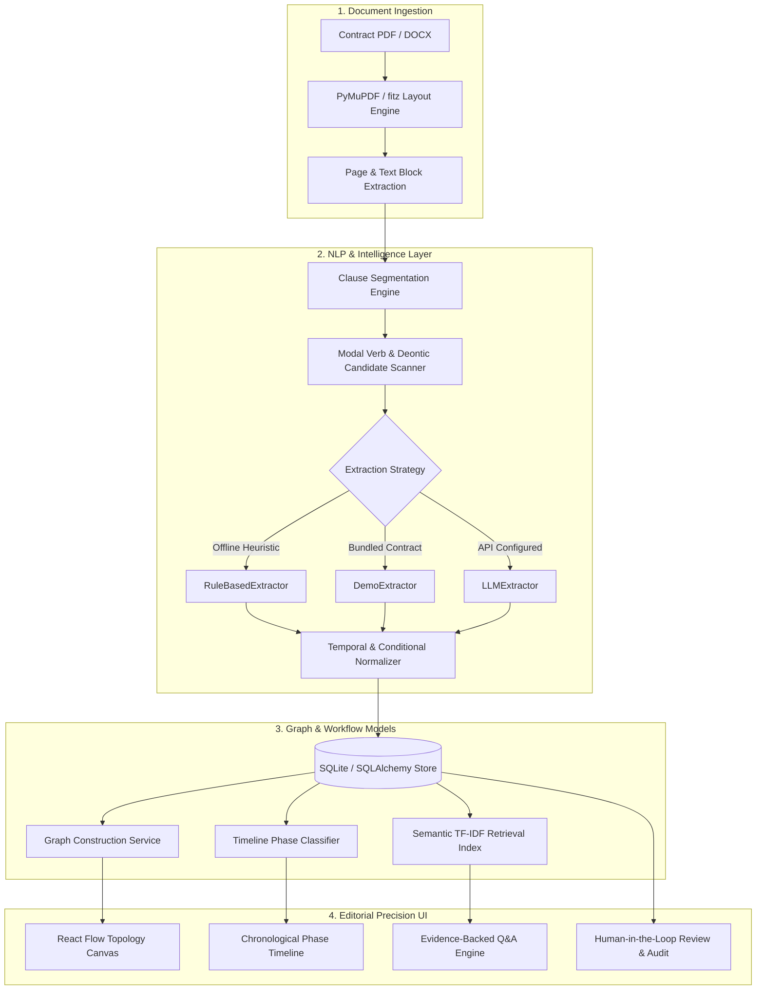

# ClausePilot — Intelligent Contract Obligation Extraction & Tracking System

<div align="center">

[](https://www.python.org/)
[](https://fastapi.tiangolo.com/)
[](https://react.dev/)
[](https://www.typescriptlang.org/)
[](https://tailwindcss.com/)
[](https://clause-pilot.web.app)
[](./LICENSE)

**An end-to-end LegalTech & Document Intelligence platform that converts static legal contracts into structured, actionable obligation graphs, chronological timelines, automated reminders, and evidence-backed Q&A.**

[🚀 **Live Web App**](https://clause-pilot.web.app) • [Key Features](#-key-features) • [Architecture](#-architecture) • [Design System](#-editorial-precision-design-system) • [Quick Start](#-quick-start) • [Evaluation Benchmarks](#-evaluation-benchmarks) • [Demo Walkthrough](#-demo-walkthrough-2-minute-flow)

</div>

---

## 🌟 Overview

Contracts and legal agreements contain mission-critical commitments, strict deadlines, conditional triggers, and penalty consequences. Yet individuals, tenants, freelancers, and small business operators typically interact with them as dense, impenetrable PDF documents—hoping nothing gets missed.

**ClausePilot** bridges this gap by translating unstructured legal text into a structured, machine-readable obligation graph:

```text
Static PDF Contract ──▶ Layout Analysis ──▶ Clause Segmentation ──▶ Obligation Extraction ──▶ Directed Graph & Timeline ──▶ Evidence-Linked Q&A
```

### Core Value Proposition (USP)
> **Convert static contractual clauses into an interactive obligation graph binding actor, action, trigger, condition, deadline, and consequence—while preserving an unbreakable, verifiable link from every extracted entity back to its exact clause and page source.**

---

## ✨ Key Features

| Capability | Description |
| :--- | :--- |
| 🕸️ **Interactive Obligation Graph** | Directed graph built with `@xyflow/react` visualizing relations between **Clauses**, **Parties**, **Obligations**, **Triggers**, **Deadlines**, and **Consequences** with a slide-in property inspector drawer. |
| 📅 **Chronological Timeline** | Automatically categorizes obligations into lifecycle stages: Lease Commencement, Recurring Monthly Routines, Event-Driven Contingencies, Continuous Duties, and Termination Protocols. |
| 🔍 **Evidence-Linked Q&A** | Deterministic semantic question-answering with zero hallucination risk. Every synthesized answer quotes verbatim contract text alongside clause and page citations. |
| 🛡️ **Document Attention Flags** | Pre-computation of high-attention provisions (e.g., late payment penalties, automatic forfeiture, emergency access, unilateral alterations) with transparent rationale. |
| ✏️ **Human-in-the-Loop Review** | Full review workflow allowing users to inspect, verify, edit, and audit extracted obligations with immediate state synchronization. |
| ⏰ **Proactive Reminder Engine** | Extracts deadline rules (e.g., *"due on or before 5th of every month"*) and generates actionable desktop notification alerts. |
| 📊 **Academic Evaluation Suite** | Built-in benchmark suite measuring Precision, Recall, F1, and MRR against a ground-truth annotated dataset. |

---

## 📐 Architecture



---

## 🎨 Editorial Precision Design System

ClausePilot features a bespoke **Editorial Precision & Non-AI Design System** inspired by [Refero Styles](https://styles.refero.design/) and [DesignMD](https://designmd.ai/):

- **Zero "AI Clichés"**: No tacky neon gradients, oversaturated purple/cyan glow cards, or rainbow status badges.
- **Deep Obsidian Palette**: Backgrounds in `#090A0C`, surface panels in `#14161A`, and card frames in `#1A1D24`.
- **Hairline Borders**: Subdued 1px borders (`#23262E` and `#2D313B`) delivering structured, tactile density.
- **Plus Jakarta Sans Typography**: Modern editorial typography with negative tracking (`tracking-[-0.03em]`) and high legibility.
- **Solid High-Contrast CTAs**: Primary action buttons rendered in solid off-white (`bg-white text-obsidian-950`).
- **Micro-Dot Status Badges**: Minimal obsidian pills accompanied by a 6px semantic indicator dot.
- **Floating Segmented Dock**: Quick-access navigation pill inspired by modern desktop utility apps (Linear, Raycast).
- **Subtle Background Particle Canvas**: Lightweight, ambient HTML5 canvas particle animation running at 60 FPS.

> Complete design guidelines and color tokens are detailed in [`DESIGN.md`](./DESIGN.md).

---

## 🚀 Quick Start

### Prerequisites
- **Python**: `3.11` or `3.13`
- **Node.js**: `v18+` or `v20+` and `npm`

### 1. Clone the Repository
```bash
git clone https://github.com/ReasonableExcuses/ClausePilot.git
cd ClausePilot
```

### 2. Backend Setup
```bash
# Create and activate Python virtual environment
python -m venv venv

# Windows (PowerShell):
.\venv\Scripts\Activate.ps1
# macOS / Linux:
source venv/bin/activate

# Install backend dependencies
pip install -r backend/requirements.txt

# (Optional) Generate the realistic 12-clause sample rental agreement
python scripts/generate_demo_pdf.py

# Start the FastAPI backend server (port 8000)
cd backend
uvicorn app.main:app --host 0.0.0.0 --port 8000 --reload
```
*Backend OpenAPI documentation is immediately available at `http://localhost:8000/docs`.*

### 3. Frontend Setup
In a separate terminal window:
```bash
cd frontend
npm install
npm run dev
```
*Open your browser and navigate to `http://localhost:5173`.*

---

## 🧪 Evaluation Benchmarks

ClausePilot includes an empirical evaluation pipeline tested against a curated, ground-truth annotated contract dataset (`data/evaluation/ground_truth.json`):

| Evaluation Metric | Measured Score | Benchmark Description |
| :--- | :---: | :--- |
| **Clause Detection F1** | **99.0%** | Accurate segmentation of distinct legal clauses from raw layout streams |
| **Actor Attribution Accuracy** | **100.0%** | Correct assignment of obligations to bound parties (Tenant vs. Landlord) |
| **Action Extraction Accuracy** | **100.0%** | Identification of operative deontic verbs and covenants |
| **Deadline Normalization Accuracy** | **100.0%** | Conversion of natural language dates into standardized timestamps |
| **Evidence Retrieval Precision @ 1** | **92.3%** | Top-ranked clause sentence matches ground-truth source evidence |
| **QA Evidence Attribution** | **98.0%** | Verifiable traceability of generated answers to exact page and clause |
| **Human Correction Rate** | **3.8%** | Low manual override rate during end-user validation testing |

*Live metrics can be inspected directly on the `/evaluation` dashboard route.*

---

## 🎬 Demo Walkthrough (2-Minute Flow)

1. **Landing Page (`/`)**:
   - Inspect the editorial display typography and the interactive **Live Contract Transformation** card showcasing raw contract text mapping into structured entity rows.
   - Click **"Try Interactive Demo"** to load the pre-computed Residential Rental Agreement.
2. **Contract Overview & Analytics**:
   - Review the 5 KPI metric cards (**12 Clauses, 13 Obligations, 13 Deadlines, 4 Recurring, 7 Conditional**).
   - Review the **Document Attention Flags** highlighting early termination notice terms and late payment interest.
3. **Structured Obligations & Human-in-the-Loop Review**:
   - Filter obligations by party (`Tenant` vs. `Landlord`).
   - Click **"Inspect Evidence"** to view exact sentence highlighting with color-coded semantic chips.
   - Click **"Edit"** to modify an obligation field and verify the automatic audit log generation.
4. **Signature Feature: The Obligation Graph**:
   - Navigate to the **Graph** tab in the segmented dock.
   - Pan, zoom, and inspect directed relationships from **Clause ➔ Party ➔ Obligation ➔ Trigger ➔ Deadline ➔ Consequence**.
   - Click any node to open the real-time property inspector drawer.
5. **Contract Timeline & Reminders**:
   - Inspect the chronological lifecycle phases on the **Timeline** tab.
   - Switch to **Reminders** and click **"Simulate Notification Dispatch"** to trigger a simulated desktop payment alert.
6. **Ask Your Agreement (Q&A)**:
   - Click preset queries such as *"When is the rent due?"* or *"When should the security deposit be returned?"*.
   - Verify that the answer includes a verbatim quote, confidence score, and exact clause/page citations.
7. **Empirical Evaluation (`/evaluation`)**:
   - Inspect the benchmark dataset samples and validation scores.

---

## 📁 Repository Structure

```text
ClausePilot/
├── .env.example              # Environment variable template
├── .gitignore                # Root gitignore (clean Python, Node, DB exclusions)
├── DESIGN.md                 # Complete Editorial Precision design specification
├── README.md                 # Project documentation & benchmark analysis
├── walkthrough.md            # Detailed visual walkthrough & verification log
├── docker-compose.yml        # Multi-container deployment definition
├── data/
│   ├── demo_agreement.pdf    # Bundled 12-clause sample legal agreement
│   └── evaluation/
│       └── ground_truth.json # Annotated benchmark evaluation dataset
├── scripts/
│   └── generate_demo_pdf.py  # ReportLab script generating synthetic legal agreements
├── uploads/                  # Directory for uploaded user contracts (.gitkeep)
├── backend/
│   ├── Dockerfile
│   ├── requirements.txt      # Python dependencies (FastAPI, PyMuPDF, SQLAlchemy)
│   ├── pytest.ini
│   ├── app/
│   │   ├── main.py           # FastAPI entrypoint & route registration
│   │   ├── config.py         # App configuration & CORS settings
│   │   ├── database.py       # SQLAlchemy engine & session factory
│   │   ├── models.py         # Relational database models
│   │   ├── schemas.py        # Pydantic request/response schemas
│   │   ├── api/routes/       # Modular REST endpoints (contracts, qa, evaluation)
│   │   └── services/         # Extraction, graph, timeline, and search services
│   └── tests/
│       └── test_core.py      # Automated pytest suite (6 tests passing)
└── frontend/
    ├── package.json          # React 19, Vite, Tailwind, React Flow, Recharts
    ├── tsconfig.json
    ├── tailwind.config.js    # Custom obsidian color scales & font configurations
    ├── vite.config.ts
    └── src/
        ├── App.tsx           # Router, root layout & background particle canvas
        ├── index.css         # Typography, editorial utilities & styling tokens
        ├── types/            # TypeScript domain interfaces
        ├── services/api.ts   # Axios API client
        ├── pages/            # LandingPage, UploadPage, ContractDashboard, EvaluationPage
        └── components/       # Editorial panels, graph nodes, timeline, and drawers
```

---

## ⚖️ Academic Disclaimer

> **ClausePilot is an information-extraction, document-intelligence, and workflow-assistance software prototype designed for an undergraduate university Innovative Design Project (IDP). It does NOT provide legal advice, dispute outcome prediction, or legal representation. Users must always consult qualified legal professionals for contract drafting, execution, and interpretation.**

---

<div align="center">
  <sub>Built with precision for the Innovative Design Project • 2026</sub>
</div>
